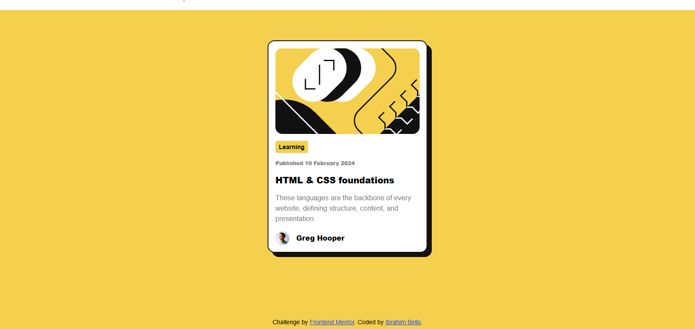

# Frontend Mentor - Blog preview card solution

This is a solution to the [Blog preview card challenge on Frontend Mentor](https://www.frontendmentor.io/challenges/blog-preview-card-ckPaj01IcS). Frontend Mentor challenges help you improve your coding skills by building realistic projects.

## Table of contents

- [Overview](#overview)
  - [The challenge](#the-challenge)
  - [Screenshot](#screenshot)
  - [Links](#links)
  - [Built with](#built-with)
- [Author](#author)

### The challenge

Users should be able to:

- See hover and focus states for all interactive elements on the page

### Screenshot

### Links

- Solution URL: [solution](https://www.frontendmentor.io/solutions/blog-preview-page-mobile-and-desktop-hmM-_m97Ag)
- Live Site URL: [live](https://repro123.github.io/Blog-Preview-Card/)

### Built with

- Semantic HTML5 markup
- CSS custom properties
- Flexbox
- Mobile-first workflow
- Tailwind CSS

## Author

- Frontend Mentor - [@yourusername](https://www.frontendmentor.io/profile/repro123)
- Twitter - [@yourusername](https://www.x.com/Dr_Repro)
